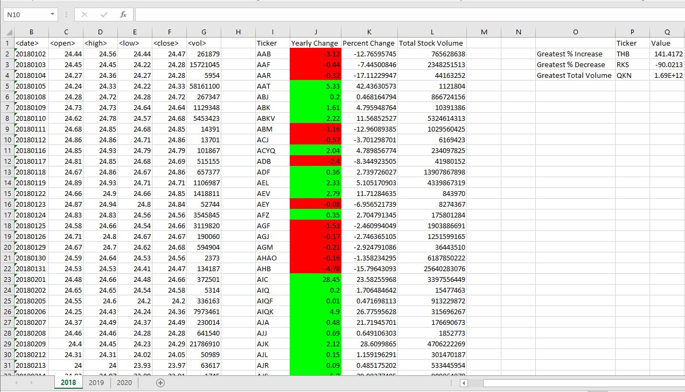
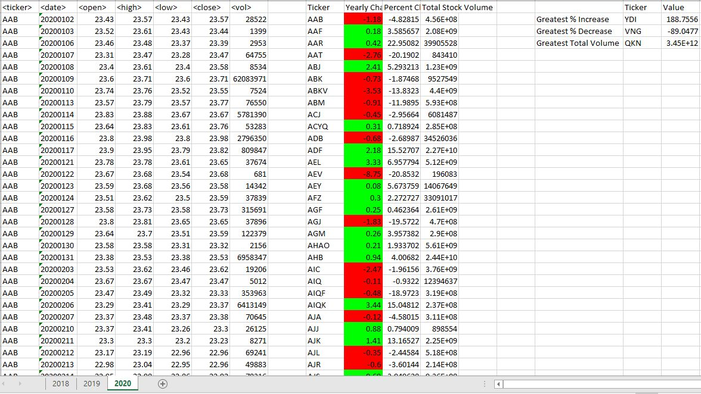

# VBA_Challenge

For this challenge, I had to create a script that loops through all the stocks for a one year and outputs the following information: 

The ticker symbol

Yearly change from the opening price at the beginning of a given year to the closing price at the end of that year.

The percentage change from the opening price at the beginning of a given year to the closing price at the end of that year.

The total stock volume of the stock.

Add functionality to the script to return the stock with the "Greatest % increase", "Greatest % decrease", and "Greatest total

Make the appropriate adjustments to the VBA script to enable it to run on every worksheet (that is, every year) at once.

